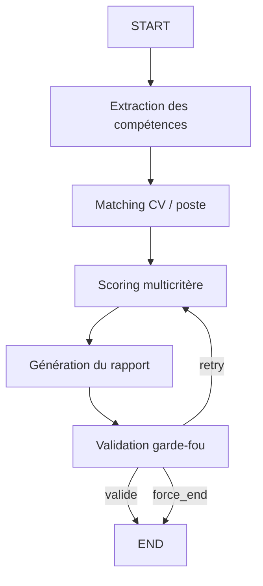

# Rapport sur le pipeline du projet RH Agent

## 1. Objet du projet

Ce projet est une application d'aide à la décision RH qui automatise l'analyse de candidatures à partir de CVs et de fiches de poste. Son objectif n'est pas de remplacer le recruteur, mais de lui fournir :

- un pré-classement rapide des candidatures ;
- une analyse plus approfondie des meilleurs profils ;
- un rapport explicatif avec scoring, points forts, lacunes et recommandation ;
- un export PDF pour consultation ou archivage.

Le système combine un backend d'orchestration IA, une base de données relationnelle, un moteur RAG pour le matching sémantique, et un frontend permettant aux recruteurs de piloter tout le processus.

## 2. Vision globale du pipeline

Le pipeline réel implémenté dans le code fonctionne en deux grandes phases :

1. Une phase de préqualification par RAG pour classer un grand nombre de CVs face à une fiche de poste.
2. Une phase d'analyse approfondie avec LangGraph sur les candidats retenus après ce premier tri.

Autrement dit, le projet suit une logique de type "filtrage large puis expertise ciblée". Cela permet d'éviter de lancer une analyse lourde sur tous les candidats, tout en gardant une évaluation détaillée pour les profils les plus prometteurs.

## 3. Architecture générale

L'application repose sur quatre blocs principaux :

- `frontend/` : interface React qui permet de créer les fiches de poste, déposer les CVs, lancer les analyses, visualiser les classements et consulter les rapports.
- `backend/` : API FastAPI qui gère les uploads, l'orchestration du pipeline, l'exécution des analyses et la génération PDF.
- `PostgreSQL` : stockage persistant des CVs, fiches de poste, analyses, états de batch, scores et rapports.
- `ChromaDB` : base vectorielle utilisée pour le RAG, alimentée par les sections des CVs et des fiches de poste.

## 4. Déroulement détaillé du pipeline

### 4.1. Création ou extraction d'une fiche de poste

Le recruteur peut créer une fiche de poste de deux manières :

- saisie manuelle dans le formulaire ;
- dépôt d'un document (`PDF`, `DOCX`, `TXT`) qui est ensuite parsé automatiquement.

Dans le cas d'un document uploadé :

1. le texte brut est extrait ;
2. un appel LLM transforme ce texte en structure exploitable ;
3. les champs métier sont préremplis dans l'interface ;
4. une fois la fiche enregistrée, elle est découpée en sections normalisées ;
5. ces sections sont indexées dans ChromaDB pour le futur matching.

Les sections normalisées sont :

- `competences`
- `experience`
- `formation`
- `profil`

Cette normalisation est essentielle, car elle permet de comparer les CVs et les fiches de poste sur des blocs homogènes plutôt que sur du texte brut non structuré.

### 4.2. Upload des CVs

Quand un CV est envoyé :

1. le backend vérifie le type du fichier et sa taille ;
2. le fichier est sauvegardé dans `data/uploads` ;
3. le texte brut est extrait avec un parseur adapté au format ;
4. le CV est immédiatement enregistré en base ;
5. une tâche en arrière-plan découpe ensuite le CV en sections ;
6. ces sections sont indexées dans ChromaDB.

Le point important ici est la séparation entre :

- la persistance immédiate du CV ;
- l'indexation différée en tâche de fond.

Ce choix améliore la réactivité de l'application : l'utilisateur n'attend pas la fin de tout le traitement sémantique pour voir son CV accepté.

### 4.3. Structuration sémantique des données

Le projet ne compare pas directement un CV brut à une fiche de poste brute. Il applique d'abord une méthodologie de structuration.

Pour chaque CV et pour chaque fiche de poste, le système produit quatre sections textuelles normalisées :

- compétences techniques ;
- expérience ;
- formation ;
- profil.

Ces sections sont reformulées par le LLM pour ressembler à une représentation RH exploitable par la recherche sémantique. L'idée est d'augmenter la qualité de similarité lors du calcul d'embeddings.

### 4.4. Phase 1 : pré-classement RAG

Quand l'utilisateur lance une analyse batch sur plusieurs CVs pour un poste :

1. le backend vérifie l'existence du poste et des CVs ;
2. il s'assure que les CVs sont bien indexés ;
3. si besoin, il force un parsing/indexing de secours ;
4. il interroge ChromaDB section par section ;
5. il calcule un score de similarité pour chaque section ;
6. il agrège ces scores dans un score RAG global ;
7. il classe tous les candidats.

Les pondérations du score RAG sont les suivantes :

- compétences : `40%`
- expérience : `30%`
- formation : `20%`
- profil : `10%`

Cette première étape sert de filtre intelligent. Elle ne produit pas encore le rapport final, mais un classement objectif de tous les CVs selon leur proximité sémantique avec le poste.

### 4.5. Intervention humaine : sélection des meilleurs profils

Une fois le classement RAG terminé, le batch passe à l'état `attente_selection`.

À ce stade, le recruteur intervient dans la boucle :

- il visualise le classement préliminaire ;
- les 3 premiers candidats sont présélectionnés par défaut ;
- il peut modifier cette sélection ;
- il déclenche ensuite l'analyse approfondie LangGraph sur les profils retenus.

Cette étape est méthodologiquement très importante, car elle introduit un contrôle humain avant la génération de rapports détaillés. Le système est donc semi-automatique, et non totalement autonome.

### 4.6. Phase 2 : analyse approfondie avec LangGraph

Une fois les candidats sélectionnés, le pipeline LangGraph s'exécute de manière séquentielle pour chaque CV choisi.

Le graphe suit cette logique :

#### Nœud 1 : extraction des compétences

Le système extrait ou réutilise :

- compétences techniques ;
- soft skills ;
- informations de profil ;
- niveau de formation ;
- années d'expérience ;
- informations de contact.

Si une structure du CV existe déjà, elle est réutilisée afin d'éviter un appel LLM inutile.

#### Nœud 2 : matching CV / fiche de poste

Le système compare ensuite le CV au poste en suivant une règle méthodologique stricte :

- le texte brut du CV reste la source de vérité principale ;
- les scores RAG sont fournis comme contexte complémentaire ;
- chaque compétence requise est évaluée selon un niveau de match.

Les niveaux possibles sont :

- `excellent`
- `bon`
- `partiel`
- `faible`
- `absent`

Ce nœud produit aussi une analyse de l'expérience et de la formation.

#### Nœud 3 : scoring multicritère

Le scoring détaillé est calculé sur quatre dimensions :

- compétences techniques ;
- expérience ;
- formation ;
- soft skills.

Le score final n'est pas purement LLM. Il est hybride :

- `70%` proviennent de l'évaluation LLM ;
- `30%` proviennent des scores RAG.

Ensuite, un score global pondéré est calculé avec la grille métier :

- compétences techniques : `40%`
- expérience : `30%`
- formation : `20%`
- soft skills : `10%`

Cette approche est intéressante, car elle combine :

- une lecture qualitative et explicative par le LLM ;
- une mesure de proximité sémantique plus stable via le RAG.

#### Nœud 4 : génération du rapport

Le LLM génère ensuite un rapport structuré contenant :

- les scores par catégorie ;
- les points forts ;
- les points faibles ;
- les correspondances de compétences ;
- une synthèse d'adéquation au poste ;
- une recommandation ;
- une justification de la recommandation ;
- un disclaimer éthique.

La recommandation suit une règle explicite :

- `score >= 70` : `Entretien recommandé`
- `50 <= score < 70` : `À considérer`
- `score < 50` : `Profil insuffisant`

### 4.7. Garde-fous et validation éthique

Après génération du rapport, un nœud de validation applique plusieurs contrôles :

- présence d'un disclaimer ;
- cohérence et bornage des scores ;
- présence des champs obligatoires ;
- conformité de la recommandation ;
- détection de mots sensibles pouvant signaler un biais.

En cas de problème critique, le système peut relancer une partie du pipeline avec un nombre limité de tentatives.

Cette couche de guardrails a un double rôle :

- sécuriser la qualité structurelle du rapport ;
- réduire le risque de biais ou de formulation inappropriée.

### 4.8. Stockage et restitution

Une fois l'analyse terminée :

- le rapport est sauvegardé en PostgreSQL ;
- le score global, le rang et la durée sont enregistrés ;
- les résultats sont exposés via l'API ;
- le frontend les affiche sous forme de tableaux, graphiques et cartes de synthèse ;
- un export PDF peut être généré à la demande.

## 5. Méthodologie globale du projet

Le projet s'appuie sur une méthodologie en plusieurs principes.

### 5.1. Structurer avant de comparer

Au lieu de comparer des documents entiers, le système transforme les données en sections homogènes. Cela améliore :

- la qualité des embeddings ;
- la précision du matching ;
- l'interprétabilité des scores.

### 5.2. Filtrer avant d'analyser en profondeur

Le projet n'envoie pas tous les CVs dans un pipeline LLM complet. Il procède en deux temps :

- classement RAG rapide sur tous les candidats ;
- analyse LangGraph seulement sur les profils retenus.

Cette stratégie réduit le coût et améliore la scalabilité.

### 5.3. Mélanger quantitatif et qualitatif

La décision finale n'est pas basée sur un seul signal. Elle combine :

- un score sémantique calculé sur embeddings ;
- une analyse explicative produite par le LLM ;
- une synthèse métier orientée RH.

### 5.4. Garder l'humain dans la boucle

Le recruteur conserve un rôle actif :

- il choisit le poste ;
- il envoie les CVs ;
- il visualise le classement préliminaire ;
- il décide quels profils méritent une analyse avancée ;
- il interprète le rapport final.

Le système assiste, mais ne décide pas à la place de l'humain.

### 5.5. Séparer stockage transactionnel et stockage vectoriel

L'architecture distingue :

- PostgreSQL pour les objets métier et les états applicatifs ;
- ChromaDB pour les représentations vectorielles et la recherche sémantique.

Cette séparation rend le système plus clair et plus maintenable.

## 6. Outils et technologies utilisés

### 6.1. Backend

- `FastAPI` pour exposer l'API REST
- `Uvicorn` pour servir l'application ASGI
- `SQLAlchemy async` et `asyncpg` pour la persistance PostgreSQL
- `Pydantic` et `pydantic-settings` pour les schémas et la configuration
- `Loguru` pour les logs
- `Tenacity` pour les retries des appels LLM

### 6.2. IA et orchestration

- `LangGraph` pour construire le pipeline d'analyse à nœuds
- `LangChain` pour l'intégration avec le modèle de langage
- `ChatOpenAI` comme interface LLM
- `OpenAI` via configuration `gpt-4o-mini` par défaut dans le code actuel

### 6.3. RAG et embeddings

- `ChromaDB` comme base vectorielle persistante
- `FastEmbed` pour calculer les embeddings en local
- modèle d'embeddings configuré : `sentence-transformers/paraphrase-multilingual-MiniLM-L12-v2`

### 6.4. Parsing documentaire

- `PyMuPDF` pour extraire le texte des PDF
- `python-docx` pour lire les fichiers DOCX
- parseur texte natif pour les fichiers TXT

### 6.5. Génération de sortie

- `ReportLab` pour créer les rapports PDF

### 6.6. Frontend

- `React 18`
- `Vite`
- `react-router-dom`
- `recharts` pour les graphiques
- `react-dropzone` pour les uploads
- `react-hot-toast` pour les notifications
- `lucide-react` pour les icônes

### 6.7. Déploiement et environnement

- `Docker`
- `Docker Compose`
- `PostgreSQL 16`

## 7. Parcours utilisateur dans l'application

Le parcours utilisateur est cohérent avec le pipeline technique :

1. création d'une fiche de poste ;
2. dépôt de plusieurs CVs ;
3. upload et indexation automatique ;
4. lancement d'un batch d'analyse ;
5. consultation du classement RAG ;
6. sélection des meilleurs candidats ;
7. lancement de l'analyse approfondie ;
8. consultation du rapport final ;
9. export éventuel en PDF.

Le frontend accompagne ce flux avec :

- une page `Dashboard` pour la vision synthétique ;
- une page `Jobs` pour les fiches de poste ;
- une page `Upload` pour le workflow de dépôt et de sélection ;
- une page `Analyses` pour suivre l'avancement ;
- une page `Report` pour consulter le rapport détaillé.

## 8. Forces du pipeline

Le pipeline présente plusieurs points forts :

- il est modulaire ;
- il distingue bien la présélection et l'analyse détaillée ;
- il évite des appels LLM inutiles grâce à la réutilisation de données déjà extraites ;
- il introduit une étape humaine avant l'analyse approfondie ;
- il combine RAG et LLM au lieu d'utiliser un seul mécanisme ;
- il ajoute des garde-fous sur la sortie finale ;
- il produit une restitution lisible, exploitable et exportable.

## 9. Limites et points d'attention

Quelques points méritent d'être signalés.

### 9.1. Écart entre la documentation et le code actuel

Le `README.md` annonce notamment :

- `GroqCloud`
- `Llama 3.3 70B`
- `Ollama`
- `mxbai-embed-large`

Mais le code actuellement présent utilise en réalité :

- `OpenAI` via `ChatOpenAI`
- `gpt-4o-mini` par défaut
- `FastEmbed`
- `sentence-transformers/paraphrase-multilingual-MiniLM-L12-v2`

Donc, pour un rapport académique ou professionnel fidèle, il faut décrire le pipeline à partir du code actuel, et non uniquement à partir du README.

### 9.2. Dépendance au parsing et à la qualité des documents

Si le texte extrait d'un CV ou d'une fiche est pauvre, mal structuré ou partiellement illisible, toute la chaîne en aval peut être impactée.

### 9.3. Risque lié aux inférences du LLM

Même avec des prompts stricts et un output structuré, un LLM peut :

- omettre une information ;
- reformuler de manière trop ambitieuse ;
- produire une justification discutable.

C'est justement pour cela que le projet ajoute :

- des scores RAG ;
- des garde-fous ;
- une validation humaine.

## 10. Conclusion

Le pipeline du projet est construit selon une logique solide et moderne d'IA appliquée au recrutement. Il repose sur une chaîne de traitement progressive :

- ingestion des documents ;
- extraction du texte ;
- structuration sémantique ;
- indexation vectorielle ;
- classement RAG ;
- sélection humaine ;
- analyse LangGraph ;
- scoring hybride ;
- génération de rapport ;
- validation éthique ;
- restitution visuelle et PDF.

Sur le plan méthodologique, le système est particulièrement pertinent parce qu'il ne réduit pas le recrutement à une simple similarité de mots-clés. Il combine :

- une approche sémantique ;
- une analyse explicative ;
- une intervention humaine ;
- une couche de sécurité éthique.

En résumé, ce projet met en place un pipeline RH intelligent, explicable et opérationnel, pensé pour assister le recruteur à chaque étape plutôt que pour le remplacer.
